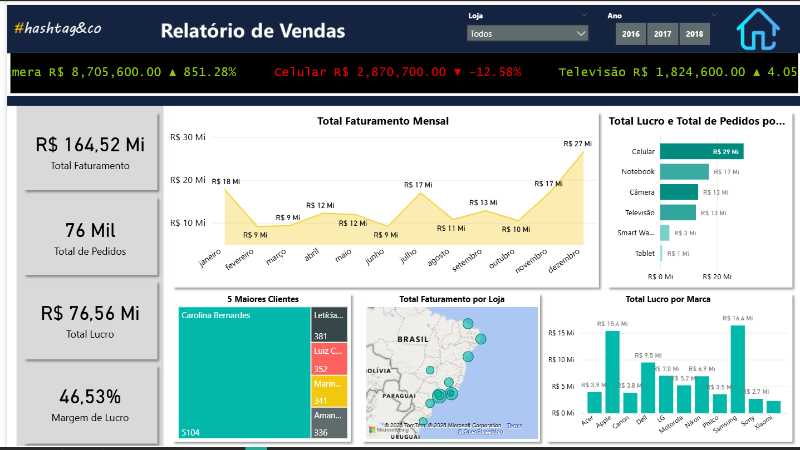

# 📊 Dashboard de Vendas — Hashtag Eletro

> Análise de desempenho comercial de uma rede de varejo de eletrônicos utilizando Power BI.



---

## 📌 Sobre o projeto

Dashboard interativo desenvolvido em **Power BI** para análise de vendas da **Hashtag Eletro**, uma rede de varejo de eletrônicos com lojas distribuídas pelo Brasil.

O projeto simula um cenário real de Business Intelligence, onde o time de gestão acompanha KPIs comerciais, identifica tendências por categoria e produto, e monitora desvios entre **Real x Meta** — tudo em um relatório executivo com 3 páginas navegáveis.

---

## 🎯 Problema de negócio

> Como o time comercial pode identificar rapidamente quais produtos e lojas estão performando abaixo do esperado, e onde concentrar esforços para recuperação de resultados?

---

## 💡 Solução desenvolvida

Relatório com 3 páginas integradas:

- **Relatório de Vendas** — visão geral com KPIs, evolução mensal, ranking por produto e mapa de lojas
- **Real vs Meta** — análise de atingimento de metas por período e categoria
- **Menu** — navegação intuitiva entre as páginas

---

## 📈 KPIs e visualizações

| Indicador | Valor (período consolidado) |
|---|---|
| Total Faturamento | R$ 164,52 Mi |
| Total de Pedidos | 76 Mil |
| Total Lucro | R$ 76,56 Mi |
| Margem de Lucro | 46,53% |

**Visualizações desenvolvidas:**
- Gráfico de linha — faturamento mensal com evolução anual (2016, 2017, 2018)
- Gráfico de barras — lucro e pedidos por categoria de produto
- Gráfico de barras — lucro total por marca (Acer, Apple, Canon, Dell, LG, Motorola, Nikon, Philco, Samsung, Sony, Xiaomi)
- Treemap — ranking dos 5 maiores clientes por volume de pedidos
- Mapa geográfico — faturamento por loja no Brasil
- Ticker dinâmico — variação de faturamento por categoria em tempo real (Câmera +851%, Celular -12,58%, Televisão +4,05%)
- Filtros interativos por Loja e Ano

---

## 🛠️ Ferramentas e técnicas

| Ferramenta | Uso |
|---|---|
| Power BI Desktop | Dashboard, visualizações e navegação entre páginas |
| DAX | KPIs calculados (Total Faturamento, Margem de Lucro, variações %) |
| Power Query | ETL — limpeza e modelagem dos dados |
| Modelagem relacional | Star Schema com tabelas: BaseVendas, BaseDevoluções, CadastroClientes, CadastroLojas, CadastroProdutos, Calendário |

---

## 📁 Estrutura do repositório

```
📦 BI_HashtagEletro_Project
 ┣ 📊 Hashtag Eletro_V04.pbix   ← Arquivo principal do Power BI
 ┣ 🖼️ screenshot.png            ← Preview do dashboard
 ┗ 📄 README.md
```

---

## 🖥️ Como visualizar

1. Instale o [Power BI Desktop](https://powerbi.microsoft.com/pt-br/desktop/) (gratuito)
2. Clone ou baixe este repositório
3. Abra o arquivo `Hashtag Eletro_V04.pbix`

---

## 🧠 Aprendizados

- Modelagem de dados em Star Schema no Power BI
- Métricas DAX: `CALCULATE`, `SUMX`, `DIVIDE`, `SAMEPERIODLASTYEAR`, variações percentuais
- Construção de ticker dinâmico com variação de categoria
- Mapa geográfico com geolocalização de lojas no Brasil
- Navegação entre páginas com botões e bookmarks
- Boas práticas de layout e UX em dashboards executivos

---

## 👤 Autor

**Gabriel Alves**
Analista de Dados | SQL · Python · Power BI | Background em Finanças e Controladoria

[](https://www.linkedin.com/in/gabriel-alves-06755822b/)

---

> Projeto desenvolvido como parte da formação em **Business Intelligence** pela Hashtag Treinamentos.
